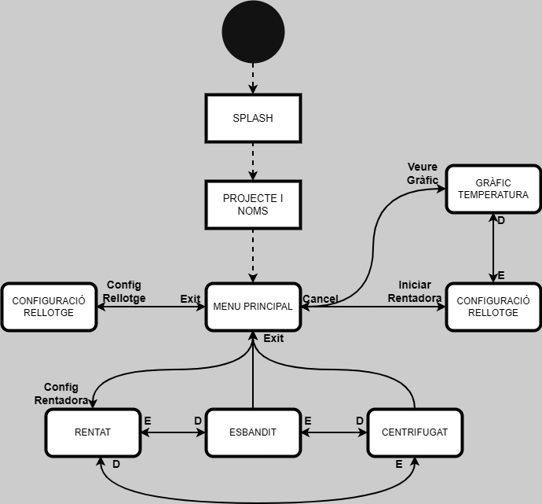
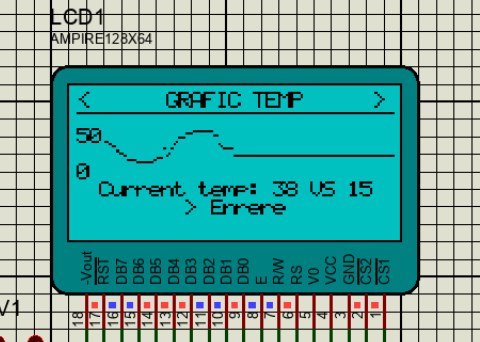
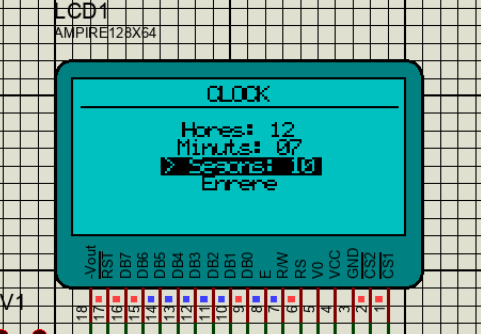

# L7 Projecte Rentadora

Projecte corresponent al L7 de l'assignatura de CI, on desenvolupem els menús que controlen la rentadora així com totes les seves etapes del rentat.

## Utilització

Els controls consten de 4 botons: les 4 direccions cardinals (esquerre, dreta, dalt, baix) i el botó de confirmació (ok).
Els botons estan col·locats en forma de creueta en el Proteus pel seu ús intuïtiu, el botó de confirmar està just a sota la creueta.

Alternativament es pot controlar per terminal de la següent manera:
- dalt - w
- esquerra - a
- baix - s
- dreta - d
- confirmar - e


S'ha decidit dissenyar una versió alternativa per la navegació de menús que hauria de ser molt intuïtiva per l'usuari:
Des del menú principal es podria accedir a tres submenús:

- Configuració Hora.
- Configuració Rentadora (amb esquerra i dreta alternem entre funcionalitats).
- Iniciar Rentat (amb esquerra i dreta alternem amb visualització de temperatura).
De totes maneres es pot trobar adjunt un diagrama amb la navegació de menús.




## Característiques

Totes les funcionalitats demanades a l'enunciat s'han implementat amb èxit.
A continuació s'expliquen modificacions i/o altres funcionalitats del projecte:

- Com s'ha esmentat a la secció anterior, la navegació de menús ha sigut modificada i adaptada per una experiència més còmode per a l'usuari.
- S'ha implementat la llibreria "screens.h" que ens dona una capa d'abstracció a l'hora de tractar cada estat de la rentadora així com facilitar la implementació de futurs estats nous. Més detalls a la [implementació tècnica](##Implementació-tècnica).
- El grafic de temperatura mostra els valors des de 0ºC fins a 50ºC. Per no ocupar molta memoria, fem servir la LCD com a memoria. És a dir, abans d'escriure un nou valor a la grafica movem tots els punts anteriors un pixel a la dreta. 
- Quan canviem la hora, per garantir una configuració correcta, el rellotge no compte el temps quan estem modificant l'hora. En la imatge següent el rellotge està parat ja que l'estem configurant, mentre que en la resta de pantalles el rellotge mesura el pas del temps. 



## Implementació tècnica

S'ha optat per una implementació modular, això permet la possible expansió del projecte en un futur sense impedir que les funcionalitats ja implementades deixen de funcionar.


```text
L7-Rentatora/
├── main.c
|
├── ascii.h
├── config.h
├── splash.h
|
├── screens.c / screens.h
|
├── GLCD.c / GLCD.h
|
├── ui.c / ui.h
|
├── buttons.c / buttons.h
|
├── usart.c / usart.h
|
├── washer.c / washer.h
|
├── clock.c / clock.h
|
├── adc.c / adc.h
|
├── temperature.c /temperature.h
|
└── pwm.c / pwm.h
```

Per una banda, diferents mòduls implementen funcionalitats aïllades del projecte (comunicació USART, convertidor ADC, botons, rellotge, PWM, washer, GLCD).
Per altra banda el mòdul 'ui' implementa funcions auxiliars d'escriptura per la pantalla GLCD.
Finalment, la unió entre la lògica i l'escriptura per pantalla es fa principalment en el mòdul 'Screen', un dels fitxers més importants del projecte.

'Screen' ens dona una traducció entre el estat de la rentadora i el contingut que hem de mostrar en pantalla. I a la viceversa ens tradueix la entrada del usuari en les modificacions corresponents a l'estat de la rentadora. 

En el main s'inicialitzen tots els mòduls, es defineix la funció de la rutina del servei a la interrupció i s'implementa el bucle principal:

1. Es llegeix l'entrada de l'usuari.
2. S'executa la lògica segons l'entrada i la pantalla.
3. S'actualitza la sortida per pantalla segons la lògica executada.

